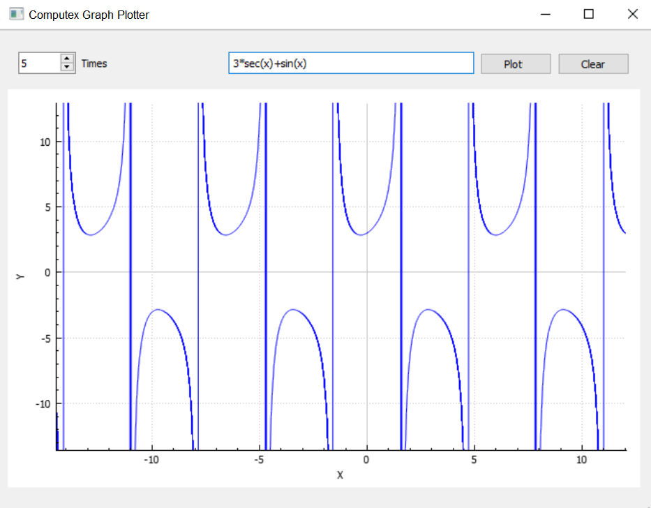

## Abstract
A mathematical-term string parser is used for the graph plotter which handles conversions from infix to postfix and eventually parses an equation into a singular value for plotting. It supports regular arithmetic operators to go with trigonometric equations/terms, including arc/inverse and hyperbolic ones. Qt library's Qtcreator is used to frame the application GUI.

For the ADT/univariate (single variable equation) polynomial operations calculator, each term is represented as a link list node of co-efficient and exponent, (with the former being a double and the later an integer) whereby the arithmetic operations are performed by functions in the abstract class PolynomialOperations. FXML is used for the GUI here. 

---
## Runscreens
- [Graph plotter for mathematical terms](https://github.com/Anirban166/Computex#graph-plotter)
- [Calculator for ADT polynomial operations](https://github.com/Anirban166/Computex#polynomial-operations-calculator)

---
Graph Plotter
---

---
Polynomial Operations Calculator 
---

